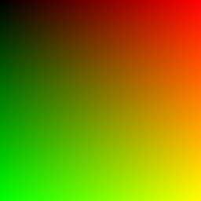

Implementation(s) of Ray Tracing in 1 Weekend
=======

| Language        | Features | Reference | Why? |
|-----|-----|------|---|
| C               | Complete | [Classic](https://raytracing.github.io/books/RayTracingInOneWeekend.html) | Simple language can compile with my own compiler |
| CUDA C          | TODO     | [NVIDIA.com](https://developer.nvidia.com/blog/accelerated-ray-tracing-cuda/) | GPU programming is fun! NVIDIA lock-in yay |
| Zig             | TODO     | [nelari.us](https://nelari.us/post/raytracer_with_rust_and_zig/) | Stricter safety guarantees, learning opportunity for me. |

Python, Go, Julia, Rust, Assembly, Sed, `><>` (fish lang), Hexagony, BF, JavaScript/TypeScript someday?

## Build System

```bash
make view FILE=c/listing1  # Render image
make test                  # Run tests
make clean                 # Clean up
make help
```

## Progress

### Basic Gradient [`./c/listing1.c`](./c/listing1.c) or [`./c/listing6.c`](./c/listing6.c)

A gradient with black, red, green, and yellow in each corner.



### HSLuv Gradient [`./c/listing1_hsluv.c`](./c/listing1_hsluv.c) or [`./c/listing6.c`](./c/listing6.c)

A gradient based on one hue, showing all possible saturation and luma values.


